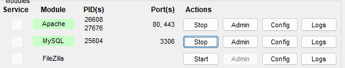

## Instrucciones

### A. Iniciar servicios
Asegurate de tener iniciado Apache (servidor web) y MySQL (base de datos) desde la interfaz de XAMPP.


### B. Ingresa a tu base de datos y verifica o crea la tabla que vas a utilizar
1. Desde tu navegador ingresa a `localhost/phpmyadmin`
2. Crea una nueva base de datos, para este ejemplo el nombre será `tienda`
3. Ve al archivo `tienda-script.sql` y modifica la información de las tablas para ajustarlas a tu producto
4. Seleccionando la nueva base de datos, en la pestaña de SQL copia y pega el contenido del archivo `tienda-script.sql` modificado y ejecutalo. 
5. Listo, ya tienes tu base de datos con registros. 

### C. Crear conexión a la base de datos
1. Dentro de la ruta `C:\xampp\htdocs\` crea una nueva carpeta para tu nuevo proyecto. Dentro de esta carpeta vamos a estar creando nuestra página web. 
2. Crea un archivo llamado `conexion.php` con las credenciales y la conexión a la base de datos, la estructura básica es la siguiente: 

```
<?php
$servername = "localhost";  // Servidor (en XAMPP es localhost)
$username = "root";       // Usuario por defecto en local o crear uno nuevo
$password = "";           // Contraseña (vacía en XAMPP por defecto)
$dbname = "tienda";  // Nombre de la base de datos

// Crear conexión
$conn = new mysqli(hostname: $servername, username: $username, password: $password, database: $dbname);

// Verificar conexión
if ($conn->connect_error) {
    die("Conexión fallida: " . $conn->connect_error);
}
?>
```

### D. Crea tu archivo index.php para la página principal. 
NOTA: Si vas a utilizar código PHP dentro del archivo la extensión tiene que ser `.php` y no `.html`


### E. Obtener la misión y la visión. (Un solo registro por consulta)
Para poder obtener la información de la base de datos en nuestro archivo debemos de cumplir con el siguiente código básico: 
```
<?php 
        include 'conexion.php';  // Incluimos el archivo de conexión
        // Definimos las variables para almacenar la misión y visión
        $sqlMision = "SELECT * FROM `generalidades` WHERE `clave` = 'mision'";
        $sqlVision = "SELECT * FROM `generalidades` WHERE `clave` = 'vision'";

        $resultMision = $conn->query(query: $sqlMision);
        $resultVision = $conn->query(query: $sqlVision);
        // Verificamos si resultMision tiene filas
        if ($resultMision->num_rows > 0) {
            $misionArray = $resultMision->fetch_assoc(); // Convertimos el resultado a array            
        } 
         // Verificamos si resultVision tiene filas
        if ($resultVision->num_rows > 0) {
            $visionArray = $resultVision->fetch_assoc(); // Convertimos el resultado a array            
        } 
        // Debemos de cerrar la conexión despues de usarla
        $conn->close();
        ?>

        <hr>
        <h4>Misión</h4>
        <p><?php echo $misionArray["valor"]; ?></p>
        <h4>Visión</h4>
        <p><?php echo $visionArray["valor"]; ?></p>
```

### F. Obtener productos. (Un array de registros)
```<?php include 'conexion.php'; 
    $sql = "SELECT p.nombre AS producto, p.precio, p.descripcion, p.foto1,  c.nombre AS categoria 
    FROM producto p 
    INNER JOIN categoria c ON p.id_categoria = c.id_categoria";
    $result = $conn->query($sql);
    if ($result->num_rows > 0) {
        // Guardar todos los resultados en un array
        $productos = $result->fetch_all(MYSQLI_ASSOC);
    } else {
        echo "No hay productos registrados.";
    }
    $conn->close();
    ?>
```
Para poder utilizar código de PHP con html, podemos aplicar la siguiente estructura
```
<!-- Iniciamos el ciclo -->
        <?php foreach ($productos as $prod) { ?>        
            <!-- Acá colocamos el código en html y si necesitamos le incluimos código php que se va a repetir -->
        <?php } ?> <!-- Cerramos el ciclo -->
```
Ejemplo
```
<!-- Iniciamos el ciclo -->
        <?php foreach ($productos as $prod) { ?>
        <div class="col-3 m-2">
            <div class="card" style="width: 18rem;">
                " class="card-img-top" alt="...">
                <div class="card-body">
                    <h5 class="card-title"><?php echo $prod["producto"]; ?></h5>
                    <p class="card-text"><?php echo $prod["descripcion"]; ?></p>
                    <p class="card-text">Precio: Q <?php echo $prod["precio"]; ?></p>
                    <p class="card-text">Categoría: <?php echo $prod["categoria"]; ?></p>
                    <a href="#" class="btn btn-primary">Ver detalle</a>
                </div>
            </div>
        </div>
        <!-- Acá colocamos el código en html y si necesitamos le incluimos código php que se va a repetir -->
        <?php } ?> <!-- Cerramos el ciclo -->
```